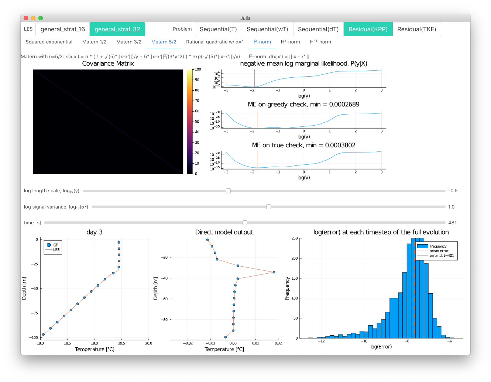
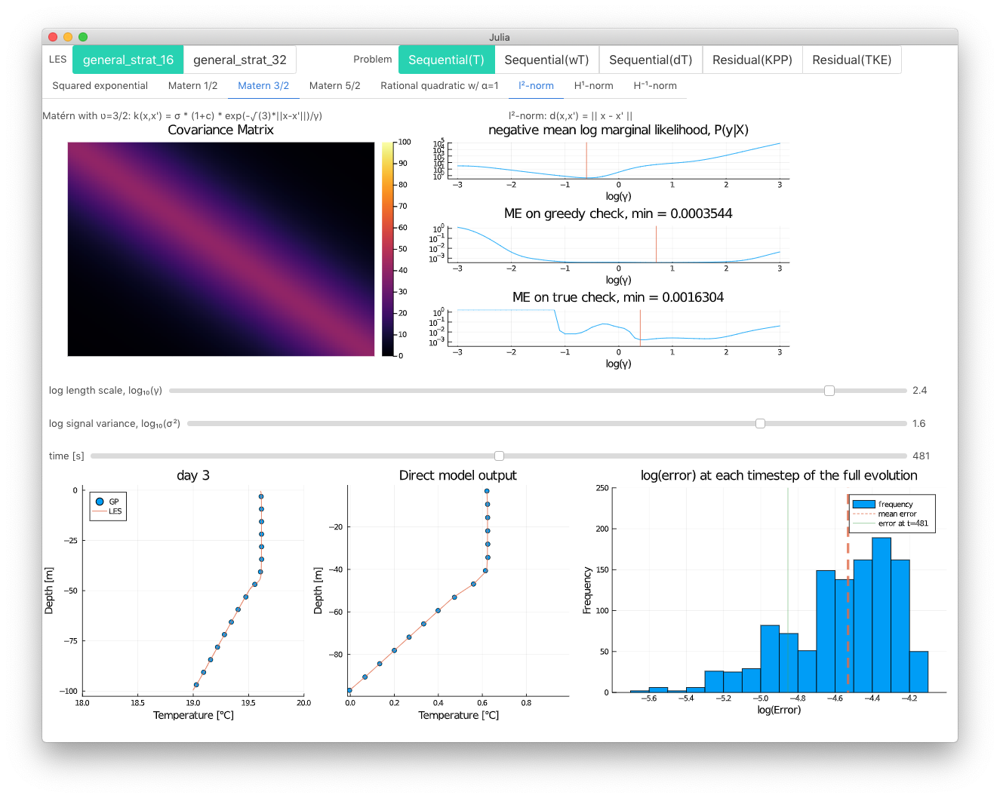

# LearnConvection.jl

### Simulation data

`src/les` Large Eddy Simulations from [Oceananigans.jl](https://github.com/CliMA/Oceananigans.jl)

* Run Oceananigans LES simulations using `src/les/run.jl`

* Harvest data from the output files in `src/les/data` using `get_les_data.jl`

### Physics-based parameterizations

`src/kpp` K-Profile Parameterizations from [OceanTurb.jl](https://github.com/glwagner/OceanTurb.jl)

`src/tke` Turbulent-Kinetic-Energy-based Parameterizations from [OceanTurb.jl](https://github.com/glwagner/OceanTurb.jl)

### Machine learning-based parameterizations

`src/gpr` Gaussian Process Regression.

* Applying GPR to predict the evolution of horizontally averaged temperature or temperature flux profiles from LES simulations.

***

### Data

For each set of data that we plan to train, validate, or test on, all of the relevant information goes into a `ProfileData` object. This object is handles all pre- and post-processing of the data. The relevant information is as follows.

```julia
filename = "general_strat_32_profiles.jld2"   # or filenames = [vector of filenames] to merge multiple simulations' data
problem  = Sequential("T")                    # see Problems section below
D        = 32                                 # collapse profile data vector down to 16 gridpoints
N        = 4                                  # collect every 4 timesteps' data for training
```

The `ProfileData` object is constructed using the `data` function (or manually: see `src/data/Data.jl` where the ProfileData struct is defined).

```julia
𝒟 = LearnConvection.Data.data(filename, problem; D=D, N=N)
```

The `ProfileData` objects used for training, validation, and testing should be created independently.

### Problems

The problem specifies which mapping we are interested in, and therefore how the data should be pre- and post-processed for the model. All problem structs are implemented in `src/gpr/problems.jl` and the scaling functions in `src/gpr/scalings.jl`. The mappings corresponding to each problem are as follows.

| Problem | Predictor  |       | Target     |
| :---    | ---:       | :---: | :--- |
| `Sequential("T")`    | ``T[i-1]``  | ``\xrightarrow{\text{model}} `` | ``T[i] `` |
| `Sequential("dT")`   | ``T[i-1]``  | ``\xrightarrow{\text{model}} `` | ``\frac{T[i]-T[i-1]}{\Delta{t'}}`` [^1]|
| `Sequential("wT")`   | ``wT[i-1]`` | ``\xrightarrow{\text{model}} `` | ``wT[i] `` |
| `Sequential("KPP",Θ)`  | ``T[i-1]`` | ``\xrightarrow{\text{model}}`` | ``\frac{T[i] - \text{KPP}(i;T[i-1])}{\Delta{t}}``   [^2] |  
| `Sequential("TKE",Θ)`  | ``T[i-1]`` | ``\xrightarrow{\text{model}}`` | ``\frac{T[i] - \text{TKE}(i;T[i-1])}{\Delta{t}}``   [^2] |
| `Residual("KPP",Θ)`  | ``\text{KPP}(i;T[i-1])`` | ``\xrightarrow{\text{model}}`` | ``\frac{T[i] - \text{KPP}(i;T[i-1])}{\Delta{t}}`` [^2] |  
| `Residual("TKE",Θ)`  | `` \text{TKE}(i;T[i-1]) `` | ``\xrightarrow{\text{model}}`` | ``\frac{T[i] - \text{TKE}(i;T[i-1])}{\Delta{t}} `` [^2] |
| `Slack("KPP",Θ)` | ``\text{KPP}(i;T[0])`` | ``\xrightarrow{\text{model}}`` | ``T[i] - \text{KPP}(i;T[0]) `` |  
| `Slack("TKE",Θ)` | `` \text{TKE}(i;T[0]) `` | ``\xrightarrow{\text{model}}`` | ``T[i] - \text{TKE}(i;T[0]) `` |  

Where T[i] is a D-length vector of values from the horizontally-averaged temperature profile at time index i, ``\Delta{t}`` is the time interval between steps, and Θ refers to the parameters for the KPP or TKE simulations (e.g. `KPP.Parameters()` or `TKEMassFlux.TKEParameters()` to use the default parameter values defined in [OceanTurb.jl](https://github.com/glwagner/OceanTurb.jl)).

``KPP(i;T[0])`` and ``TKE(i;T[0])`` are the KPP and TKE model predictions, respectively, for ``T[i]`` given initial condition ``T[0]``, and ``KPP(i;T[i-1])`` and ``TKE(i;T[i-1])`` are the KPP and TKE model predictions, respectively, for ``T[i]`` given initial condition ``T[i-1]``.

**Note that all temperature profiles are normalized using min-max scaling during pre-processing and un-normalized during post-processing.** This scaling is computed based on the profile at the initial timestep.

[^1]:
    ``\Delta{t'}`` is a rescaled time interval equal to ``\Delta{t} / N^2``, where ``N^2`` is the initial buoyancy stratification.
[^2]:
    The ``T[i-1]`` given to the KPP or TKE model as an initial condition at each time index (i.e. the ``T[i-1]`` in ``KPP(i;T[i-1])`` and ``TKE(i;T[i-1])``) is the LES prediction for ``T[i-1]`` during training, but the previous time step’s “corrected” prediction (`Prediction` in the second table) during testing.

We take the model output and predict the profile from it as follows.

| Problem | Prediction   |
| :---    | :---         |
| `Sequential("T")`      | ``f(\mathbf{x}) = model(\mathbf{x})``  |
| `Sequential("dT")`     | ``f(\mathbf{x}) = model(\mathbf{x})\Delta{t'} + T[i-1]``  |
| `Sequential("wT")`     | ``f(\mathbf{x}) = model(\mathbf{x})`` |
| `Sequential("KPP",Θ)`  | ``f(\mathbf{x}) = {model}(\mathbf{x})\Delta{t} + KPP(i;T[i-1])`` |  
| `Sequential("TKE",Θ)`  | ``f(\mathbf{x}) = {model}(\mathbf{x})\Delta{t} + TKE(i;T[i-1])`` |
| `Residual("KPP",Θ)`    | ``f(\mathbf{x}) = {model}(\mathbf{x})\Delta{t} + KPP(i;T[i-1])`` |  
| `Residual("TKE",Θ)`    | ``f(\mathbf{x}) = {model}(\mathbf{x})\Delta{t} + TKE(i;T[i-1])`` |
| `Slack("KPP",Θ)`       | ``f(\mathbf{x}) = {model}(\mathbf{x}) + KPP(i;T[0])`` |  
| `Slack("TKE",Θ)`       | ``f(\mathbf{x}) = {model}(\mathbf{x}) + TKE(i;T[0])`` |

Where ``model(\mathbf{x})`` is the direct model output on predictor ``\mathbf{x}``, which we hope will be close to the target.

See [OceanTurb.jl](https://github.com/glwagner/OceanTurb.jl) documentation for KPP and TKEMassFlux parameter options.

### Error

We have two functions for measuring error: `get_me_greedy_check`, which evaluates model fit on the training data, and `get_me_true_check`, which is our loss function as it tells us about model performance.

`get_me_greedy_check` computes the mean error on the "greedy" check, which tells us how the model performs on the subset of the training data reserved for validation (according to `N`). It is the mean across all validation timesteps, ``X``, of the euclidean distance between the direct model output, ``{model} (\mathbf{x}_\mathbf{i})``, and the target prediction, ``\mathbf{y}_\mathbf{target, i}``, for each predictor, ``\mathbf{x}``.

```math
ME_{greedy} = \frac{1}{n_t}\ \sum_{i \in X}\lVert {model} (\mathbf{x}_\mathbf{i}) - \mathbf{y}_\mathbf{target, i} \rVert
```

`get_me_true_check` computes the mean error on the "true" check. It is the mean across all timesteps (of which there are ``n_t``) of the euclidean distance between the prediction (computed from the model output as in Prediction column of the table above) and the truth (which comes directly from the LES simulation with each vector having been averaged down to `D` gridpoints in the vertical).

The meaning of the prediction depends on the type of problem.

If the problem is a `Sequential` or `Residual` problem, the mean error is computed as follows.

```math
ME_{true} = \frac{1}{n_t}\ \sum_{i=1}^{n_t-1} \lVert \hat{\mathbf{y_i}} - \mathbf{y_i} \rVert
```

```math
\hat{\mathbf{y_i}} = f( \hat{\mathbf{y}}_\mathbf{i-1} )
```

```math
\hat{\mathbf{y_0}} = \mathbf{x_0}
```

Each timestep's profile is predicted based on the previous model's timestep, with the initial condition at time index i=0 being the initial condition of the true simulation. The error thus evaluates how accurately the model evolves the profile forward from the initial profile ``\mathbf{x_0}``--which is the only information the model is supplied with during testing.

If the problem is a `Slack` problem, the mean error is computed as follows.

```math
ME_{true} = \frac{1}{n_t}\ \sum_{i=0}^{n_t-1} \lVert {f} (\mathbf{x_i}) - \mathbf{y_i} \rVert
```

The error evaluates how well the model predicts the true profile at a given time index based solely on the prediction from the `KPP` or `TKE` model at the same time index.

***

## Gaussian Process Regression

Gaussian Process (GP) regression produces a distribution over functions that interpolate the training data.
Here we concern ourselves with the mean GP prediction.

### Kernels

The kernel (or covariance) function sets the form of the interpolation function.

| Kernel ID | Name        | Parameters | Equation |
| :---:     |    :---     | :---       | :---     |
| 1         | Squared exponential     | γ, σ | ``k(x,x') = \sigma e^{ - {d(x,x')}^2 / 2 \gamma^2 }`` |
| 2         | Matérn with ʋ=1/2       | γ, σ | ``k(x,x') = \sigma e^{ - d(x,x') / \gamma }`` |
| 3         | Matérn with ʋ=3/2       | γ, σ | ``k(x,x') = \sigma (1+c) e^{-\sqrt{3} d(x,x'))/\gamma}`` |
| 4         | Matérn with ʋ=5/2       | γ, σ | ``k(x,x') = \sigma ( 1 + \frac{\sqrt{5}d(x,x')}{\gamma} + \frac{5{d(x,x')}^2}{3\gamma^2} ) e^{-√(5) \frac{d(x,x')}{\gamma}}`` |
| 5         | Rational quadratic      | γ, σ, α | ``k(x,x') = \sigma (1+(x-x')'(x-x')/(2*\alpha (\gamma^2))^{-\alpha}`` |
| 6         | Spectral mixture product | ``\mu, \sigma, w`` | ``\prod_{p=1}^{P} \sum_{a=1}^{A} w_{p,a}^2 \text{exp} ({-2\pi^2\tau_p^2 \sigma_{p,a}^2}) \cos{(2\pi\tau_p\mu_{p,a})}``, ``\tau = x-x'`` [^3]|

Where γ is a length-scale parameter, σ is a signal variance parameter, α is an additional parameter used only in the rational quadratic kernel, and ``d`` is the distance metric used in the kernel function. The options for ``d`` are `euclidean_distance`, `derivative_distance`, and `antiderivative_distance`.

[^3]:
    SMP: GPatt: Fast Multidimensional Pattern Extrapolation with GPs, arXiv 1310.5288, 2013, by Andrew Gordon Wilson, Elad Gilboa, Arye Nehorai and John P. Cunningham. Implemented in MATLAB .

### Basic Example

In this example, we train our model and test our model on the data from the same simulation.
```julia
# problem
params   = KPP.Parameters()
problem  = Residual("KPP", params)

# data
train    = ["general_strat_4_profiles.jld2", "general_strat_16_profiles.jld2"]
test     = "general_strat_32_profiles.jld2"
D        = 16
N        = 4

# kernel
k        = 1
logγ     = 0.4
logσ     = 0.0
distance = euclidean_distance
kernel   = get_kernel(k, logγ, logσ, distance)

# data
𝒟_train  = LearnConvection.Data.data(train, problem; D=D, N=N);
𝒟_test   = LearnConvection.Data.data(test, problem; D=D, N=N);

# 𝒢 is trained on 𝒟_train
𝒢 = LearnConvection.GaussianProcess.model(𝒟_train; kernel = kernel)

# animate the mean GP prediction, where 𝒢 is tested on 𝒟_test
anim = animate_profile_and_model_output(𝒢, 𝒟_test)
gif(anim, "basic_example.gif")
```
This should output the following animation.


Where the plot on the left shows the mean GP prediction (blue dots) on the test data compared to the truth from the LES test simulation (orange line), and the plot on the right shows the direct model output (blue dots) compared to the target (orange line).

### Interactive example

Run `examples/gpr/interact.jl` for an interactive exploration of GPR that uses [Interact.jl](https://github.com/JuliaGizmos/Interact.jl) and [Blink.jl](https://github.com/JuliaGizmos/Blink.jl).




